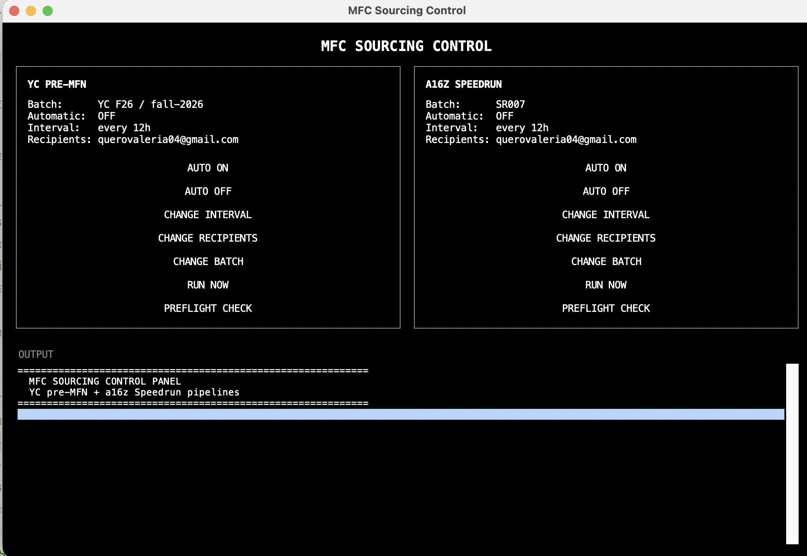

# MFC Sourcing Pipelines: YC pre-MFN + a16z Speedrun



Two related, independent sourcing pipelines live in this folder:

- **YC pre-MFN pipeline** (`yc_list_raw.py`, `li_search_selenium.py`, `li_native_search.py`,
  `li_unified_leads.py`, `li_yc_cross_reference.py`, `classify_leads.py`, `send_leads_report.py`):
  finds YC companies before they hit YC's public directory.
- **a16z Speedrun pipeline** (`sr_queries.py`, `sr_google_search.py`, `sr_li_native_search.py`,
  `sr_unified_leads.py`, `classify_sr_leads.py`, `send_sr_leads_report.py`, plus the control
  files `sr_config.py`/`sr_config.json`, `sr_configure.py`, `sr_run_pipeline.py`,
  `sr_preflight_check.py`): adapted from the YC pipeline; see "Why this isn't a straight
  port" below for why the architecture differs.

They share infrastructure: the same logged-in LinkedIn Chrome profile (`li_chrome_profile/`),
the same Anthropic API key, and the same Gmail SMTP setup.

## Installation (one time, per machine)

1. **Clone the repo:**
   ```
   git clone git@github.com:valeriaeqhernandez/mfc_yc_update.git
   cd mfc_yc_update
   ```

2. **Install Google Chrome** if you don't already have it (download it from google.com/chrome). Both pipelines drive a real Chrome install via Selenium; they don't bundle a browser of their own.

3. **Create and activate a virtual environment:**
   ```
   python3 -m venv .venv
   source .venv/bin/activate
   ```
   You'll need to run that `source .venv/bin/activate` line again every time you open a new terminal window to run any of these scripts by hand; it's what puts the right `python` on your `PATH`. Automatic mode and the GUI app don't need this: they're already wired to call the venv's Python directly by its full path.

4. **Install dependencies:**
   ```
   pip install -r requirements.txt
   ```

That's it for installation. Continue to "Quick start" below to actually configure and turn the pipelines on.

## Quick start: turning automatic mode on

The one thing you actually need if you just want this running on its own, no code reading required (assumes you've done the one-time installation above):

1. **One-time credential setup.** Open (creates it if it doesn't exist yet):
   ```
   open -e ~/.zshenv
   ```
   Paste these three lines in, with your real values, save, close:
   ```
   export ANTHROPIC_API_KEY=sk-ant-...
   export SMTP_USERNAME=you@gmail.com
   export SMTP_PASSWORD=your16charapppassword
   ```
   (`SMTP_PASSWORD` is a Gmail **App Password**, not your normal password; see "Setup" below if you need to generate one. Open a **new** terminal window afterward so it picks these up.)

2. **One-time LinkedIn login**, shared by both pipelines:
   ```
   python li_native_search.py --login-only
   ```
   A browser window opens: log in normally, then come back and press Enter.

3. **Check everything's actually working** before trusting an unattended run:
   ```
   python yc_preflight_check.py
   python sr_preflight_check.py
   ```
   Both should print `All checks passed.` If not, fix whatever it flags before continuing.

4. **Turn it on**: two ways to do this, both with the same underlying effect.

   **Double-click `MFC Pipeline Control.app`**: a black control-panel window, no terminal needed (see screenshot at the top of this README). YC and Speedrun each get their own status readout and buttons (AUTO ON / AUTO OFF / CHANGE INTERVAL / CHANGE RECIPIENTS / CHANGE BATCH / RUN NOW / PREFLIGHT CHECK), with a live output console at the bottom showing whatever's currently running. Click **AUTO ON** for whichever pipeline(s) you want running on their own.

   **Or, from a terminal:**
   ```
   python yc_configure.py # for the YC pipeline
   python sr_configure.py # for the a16z Speedrun pipeline
   ```
   Pick **option 1** ("Turn automatic mode ON") from the menu.

   Either way: it now runs on its own on a schedule (12 hours by default), survives reboots, and emails you the results. Same place you'd change how often it runs, who gets emailed, or turn it back off.

Nothing below this point is required reading to just turn it on. The rest of this file is reference material for when you want to understand *why* something works the way it does, or need to do something less common (switch to a new batch, debug an empty run, etc.).

## File-by-file glossary

### Shared

| File | What it is |
|---|---|
| `li_chrome_profile/` | Persistent, logged-in Chrome profile used by **both** pipelines' LinkedIn scripts. Set up once with `python li_native_search.py --login-only`; never touched directly otherwise. |
| `requirements.txt` | Python dependencies for everything in this folder (`requests`, `selenium`, `undetected-chromedriver`, `openpyxl`). |
| `.gitignore` | Keeps `.venv/`, `li_chrome_profile/` (real session cookies), and the two runtime lock files out of git. |
| `MFC Pipeline Control.app` | Double-clickable GUI: see "Quick start" above. Just a launcher wrapping `control_panel.py`; delete/re-create it any time without losing anything, nothing is stored inside it. |
| `control_panel.py` | The actual GUI (black window, white text) both pipelines' controls live in. Calls the exact same underlying functions `sr_configure.py`/`yc_configure.py` do: same config files, same `launchd` plist handling, just a different front-end. Can also be run directly (`python control_panel.py`) without the `.app` wrapper. |
| `.sr_run_pipeline.lock` / `.yc_run_pipeline.lock` | Created for the duration of a run, deleted when it finishes; prevents a second scheduled run from starting while one's still in progress (confirmed live that overlapping runs crash each other by launching concurrent Chrome sessions against the same shared LinkedIn profile). Self-heals if a run gets killed abnormally and leaves one behind; safe to delete by hand if you're ever sure nothing is actually running. |

### YC pre-MFN pipeline

| File | What it is |
|---|---|
| `yc_list_raw.py` | Pulls YC's own public company directory for a batch (via the `yc-oss/api` mirror of YC's Algolia index; avoids scraping ycombinator.com directly, which its robots.txt disallows). This is the pipeline's ground truth. Snapshots land in `yc_snapshots/`. |
| `li_search_selenium.py` | Anonymous Google search (via undetected-chromedriver) for LinkedIn posts/bios mentioning the batch tag. Snapshots in `li_snapshots_selenium/`. |
| `li_native_search.py` | Searches LinkedIn's own Posts and People search directly, using the logged-in `li_chrome_profile/`. Also the script that performs the one-time LinkedIn login (`--login-only`). Snapshots in `li_native_snapshots/`. |
| `li_unified_leads.py` | Combines all of the above (Google bio-tag, Google announcement, LinkedIn posts, LinkedIn people) into one run, cross-references against `yc_list_raw.py`'s directory to flag which leads are genuinely **not yet** publicly listed, and writes `leads_<batch-slug>.json`. |
| `li_yc_cross_reference.py` | An earlier, narrower version of the cross-referencing step: combines just `yc_list_raw.py` + `li_search_selenium.py` (2 of the 3 sources `li_unified_leads.py` now covers). Kept for reference / as a lighter-weight check; `li_unified_leads.py` is the one to actually run. |
| `classify_leads.py` | Sends each lead's snippet to Claude to distinguish a genuine "X joined YC" signal from noise (deadline reminders, generic encouragement, etc.). Adds `ai_relevant`/`ai_reason` fields to `leads_<slug>.json` in place. |
| `send_leads_report.py` | Writes `leads_<slug>.xlsx` and emails it: always on the first run, otherwise only when the lead list actually changed (see `report_snapshots/`). |
| `leads_fall-2026.json` / `.xlsx` | Output of the pipeline for the Fall 2026 batch: the actual deliverable. |
| `yc_snapshot.json`, `yc_snapshots/`, `li_snapshots_selenium/`, `li_native_snapshots/`, `report_snapshots/` | Per-batch state each script uses to detect what's new since the last run. Don't delete these; deleting them resets "what's new" tracking, not the underlying data. |
| `yc_config.py` / `yc_config.json` | The settings meant to be tweaked without touching code: batch tag, YC batch slug, recipients, automatic-mode on/off, run interval. Edit via `yc_configure.py`. |
| `yc_configure.py` | Terminal menu: toggle automatic mode, change interval/recipients/batch, trigger a manual run, run a preflight check. Mirrors `sr_configure.py`. |
| `yc_run_pipeline.py` | Runs the 3 real YC steps in order with one command (`li_unified_leads.py` → `classify_leads.py` → `send_leads_report.py`). What both manual runs and automatic mode actually invoke. |
| `yc_preflight_check.py` | Confirms credentials, SMTP login, Chrome/LinkedIn setup, and that the configured YC batch slug actually resolves, before you trust an unattended run. |

### a16z Speedrun pipeline

| File | What it is |
|---|---|
| `sr_queries.py` | Query templates + bio-pattern regexes for whichever batch is set in `sr_config.json`. Reads `CURRENT_BATCH`/`CURRENT_BATCH_NUM` from config rather than hardcoding them. |
| `sr_google_search.py` | Anonymous Google search, adapted from `li_search_selenium.py`. Raw hits land in `snapshots/<BATCH>/google_raw_<date>.json`. |
| `sr_li_native_search.py` | LinkedIn Posts + People search via the shared `li_chrome_profile/`, adapted from `li_native_search.py`. Raw hits land in `snapshots/<BATCH>/li_posts_raw_<date>.json` and `li_people_raw_<date>.json`. |
| `sr_unified_leads.py` | No YC-style ground truth exists for an in-progress Speedrun batch, so this extracts company-name candidates from the raw hits above and merges them into a persistent **provisional roster**, `sr_roster_<BATCH>.json`; every entry stays provisional until Demo Day. |
| `classify_sr_leads.py` | AI pass over the roster: each candidate becomes CONFIRMED / UNCERTAIN / REJECTED (see below). Writes `sr_roster_classified_<BATCH>.json`. |
| `send_sr_leads_report.py` | Writes `<batch>_leads_report.xlsx` and emails it **every run** (unlike the YC version): see "Email notifications" below. Tracks state in `sr_last_sent_<BATCH>.json`. |
| `sr_config.py` / `sr_config.json` | The settings meant to be tweaked without touching code: recipients, automatic-mode on/off, run interval, current batch. Edit via `sr_configure.py`. |
| `sr_configure.py` | Terminal menu: toggle automatic mode, change interval/recipients/batch, trigger a manual run, run a preflight check. |
| `sr_run_pipeline.py` | Runs all five Speedrun steps in order with one command. What both manual runs and automatic mode actually invoke. |
| `sr_preflight_check.py` | Confirms credentials, SMTP login, and Chrome/LinkedIn setup are all actually working before you trust an unattended run. |
| `sr_roster_SR007.json`, `sr_roster_classified_SR007.json`, `sr_last_sent_SR007.json`, `sr007_leads_report.xlsx` | Output for the current batch (SR007) specifically: filenames change automatically when the batch changes (see below). |
| `snapshots/` | Per-batch raw search hits (`snapshots/SR007/...`), same "don't delete, resets tracking" note as the YC snapshot folders. |

## Setup

### Credentials: what's needed, and where each one is actually used

| Credential | Used by | What it's for |
|---|---|---|
| A logged-in LinkedIn session in `li_chrome_profile/` | `li_native_search.py`, `sr_li_native_search.py` | Searching LinkedIn's own Posts/People search as a real logged-in user; there's no public API for this, so **you must be logged in before running either script**. Both drive your real LinkedIn session, and this kind of automated search volume is exactly what LinkedIn's anti-automation systems watch for. One-time setup, shared by both pipelines: `python li_native_search.py --login-only` (opens a browser window for you to log in by hand). |
| `ANTHROPIC_API_KEY` | `classify_leads.py`, `classify_sr_leads.py` | The AI pass that separates real join-signals from noise, on either pipeline. Get a key at console.anthropic.com → API Keys (the account needs billing set up). Not needed by either search script or either report script. |
| `SMTP_USERNAME` / `SMTP_PASSWORD` | `send_leads_report.py`, `send_sr_leads_report.py` | Sending the report email via Gmail, on either pipeline. `SMTP_PASSWORD` must be a Gmail **App Password** (16 characters, from myaccount.google.com → Security → 2-Step Verification → App Passwords); your regular Gmail password will not work here. |

Set all three as environment variables in `~/.zshenv` (not `~/.zshrc`): `.zshenv` loads for every shell, including the non-interactive one `launchd` uses for Speedrun's automatic mode:
```
export ANTHROPIC_API_KEY=sk-ant-...
export SMTP_USERNAME=you@gmail.com
export SMTP_PASSWORD=your16charapppassword
```

Then run `python yc_preflight_check.py` / `python sr_preflight_check.py` any time to confirm all of the above actually works; each does a real SMTP login test and checks Chrome/the LinkedIn profile, without spending anything on the Anthropic API (the YC one also does a free live check that the configured batch slug resolves against YC's API).

### Google's consent screen

On some runs, especially the first one or after clearing the browser profile, Google shows a cookie-consent page before search results ("Before you continue to Google," with an **Alle akzeptieren** / **Accept all** button; exact wording depends on locale). `sr_google_search.py` detects this (`consent.google.com` in the URL) and pauses for up to 3 minutes for you to click through it manually in the visible browser window: expected behavior, not an error. It's normally remembered after the first time. `li_search_selenium.py` doesn't have this specific consent-wall check, but its CAPTCHA-handling (`--headful` + manual solve) works the same way if you see one there.

## Switching to a new batch

Either the GUI's **CHANGE BATCH** button or the terminal menus below; same underlying change either way.

### YC

```
python yc_configure.py
```
→ option 7, enter the new batch tag (e.g. `"YC W27"`) and YC batch slug (e.g. `winter-2027`), confirm. The batch tag must match how founders actually write the tag in bios; the batch slug must match YC's own URL slug for that batch. Every output file (`leads_<slug>.json/.xlsx`, snapshot files) is already named from the slug, so old and new batches never collide.

### a16z Speedrun

```
python sr_configure.py
```
→ option 7, enter the new batch code (e.g. `SR008`), confirm. `sr_queries.py` reads the batch from `sr_config.json`, and every downstream file (`sr_roster_<BATCH>.json`, `sr_roster_classified_<BATCH>.json`, `sr_last_sent_<BATCH>.json`, `<batch>_leads_report.xlsx`, `snapshots/<BATCH>/`) is named from it: switching batches starts a clean roster for the new one without touching or losing the old batch's data. If the new batch's bio convention differs from `(SR###)` (a rebrand, a different numbering scheme), you'll also need to hand-edit the query patterns in `sr_queries.py` itself; the config only controls *which files* the pipeline reads/writes, not the query wording.

Since Python caches already-imported modules, restart anything already running (the GUI, `sr_configure.py`/`yc_configure.py` itself, an open Python shell) after switching for the new batch to actually take effect.

## Running it

### Manual run

```
python yc_run_pipeline.py     # YC
python sr_run_pipeline.py     # a16z Speedrun
```

Each runs its pipeline's steps in order and emails the result. YC's `li_unified_leads.py` already internally covers the YC-directory fetch, Google search, and both LinkedIn searches in one script, so that pipeline is 3 steps total; Speedrun's search/merge steps are split into separate scripts, so that pipeline is 5. Roughly **8–12 minutes** end to end either way on a normal run; most of that is deliberate pacing delays between search queries (so this doesn't look like bot traffic) plus LinkedIn's slower page loads. Add a few extra minutes any time a CAPTCHA or the consent screen above needs solving by hand.

The GUI's **RUN NOW** button does the same thing, but always non-interactively: there's no terminal attached to pause and solve a CAPTCHA/checkpoint in, so any that come up get skipped rather than waited-on (same as automatic mode). Use the terminal commands above instead if you specifically need to solve one by hand.

### Day-to-day controls

Double-click **`MFC Pipeline Control.app`** for a GUI (see "Quick start" above), or from a terminal:

```
python yc_configure.py        # YC
python sr_configure.py        # a16z Speedrun
```

Both are front-ends for the exact same underlying logic: turn automatic mode on/off, change how often it runs, change who gets the report, change the batch, trigger a manual run right now, or run a preflight check. Everything changes `yc_config.json` / `sr_config.json` respectively; only hand-edit those files if you're comfortable with exact JSON syntax (a stray comma breaks every script that reads it).

### Automatic mode

Turned on/off from either the GUI or each pipeline's own `configure.py` (options 1/2); implemented as a macOS `launchd` job, not a background Python loop, so it survives reboots and doesn't stop when you close the terminal (or the GUI window). The two pipelines use separate `launchd` jobs (`capital.multifaceted.yc-pipeline` / `capital.multifaceted.sr-pipeline`), so each can be turned on/off independently. Each runs its `run_pipeline.py --non-interactive` on whatever interval is set in its own config file (option 3 / CHANGE INTERVAL to change it; takes effect immediately, no need to turn it off and back on).

**Pick an interval longer than a full run takes (8–12 min, see "Manual run" above).** Each run acquires a lock file (`.yc_run_pipeline.lock` / `.sr_run_pipeline.lock`) for its duration, so if the interval is shorter than that, the next scheduled trigger just skips itself with a log message rather than starting a second, overlapping run: confirmed live that overlapping runs crash each other by launching concurrent Chrome sessions against the same shared LinkedIn profile. The lock protects against that outcome, but a too-short interval still means most scheduled triggers do nothing.

In non-interactive mode, a Google CAPTCHA or LinkedIn checkpoint page gets **skipped** for that run instead of waited-on, since nobody's there to click through it. Check `~/Library/Logs/yc-pipeline.log` / `~/Library/Logs/sr-pipeline.log` occasionally, and re-run `python li_native_search.py --login-only` if scheduled runs start coming back suspiciously empty (a sign the LinkedIn session expired).

Run `python yc_preflight_check.py` / `python sr_preflight_check.py` (or the GUI's PREFLIGHT CHECK button) before turning automatic mode on for the first time on either pipeline.

## Email notifications (Speedrun)

Unlike the YC pipeline's report script (silent when nothing changed), `send_sr_leads_report.py` emails **every run**, so silence never has to be interpreted as "did this even run today?":
- Nothing new: `[a16z Speedrun SR007] No updates since Aug 25, 2026`
- Something new: `[a16z Speedrun SR007] 2 new lead(s): Acme Inc, Foo Corp`

Both attach the current spreadsheet either way. Dates throughout the report and email are shown in plain form (`Aug 25, 2026`), not the ISO timestamps (`2026-08-25T14:40:03+00:00`) used internally in the JSON files.

## What CONFIRMED / UNCERTAIN / REJECTED mean (Speedrun)

Set by `classify_sr_leads.py`'s AI pass over each candidate's evidence:

- **CONFIRMED**: a founder/team member of that company, or an a16z Speedrun staff member, explicitly said (in a LinkedIn post, headline, or similar) that the company is part of the batch. This is what goes in the emailed spreadsheet.
- **UNCERTAIN**: a real signal, but weak: single-sourced, an ambiguous/generic company name, or phrasing that doesn't clearly commit. Worth a human glance, not confident enough to report as CONFIRMED.
- **REJECTED**: the evidence doesn't hold up: a generic applications-open announcement, a scout/"DM me" post, a mention of a different batch, a scraped UI/metadata fragment mistaken for a company name, or not a real company name at all.

Every candidate stays in `sr_roster_<BATCH>.json` / `sr_roster_classified_<BATCH>.json` regardless of verdict; REJECTED means excluded from the emailed spreadsheet, not deleted, so a later run with stronger evidence can still flip it to CONFIRMED. (The YC pipeline's `classify_leads.py` uses a simpler true/false `ai_relevant` flag instead of this three-way verdict, since it has YC's own directory as a downstream check that Speedrun doesn't have; see below.)

## Why the Speedrun pipeline isn't a straight port of the YC one

The YC pipeline works because of one load-bearing fact: **YC publishes an official,
machine-readable company directory** (the Algolia backend behind `yc-oss/api`), which
updates continuously as YC processes paperwork. That directory is the pipeline's ground
truth: `yc_list_raw.py` pulls it, and `li_unified_leads.py` cross-references social
signals against it to confirm a match and strip false positives.

**Speedrun has no equivalent.** a16z does not publish *any* list of an in-progress
cohort's companies, not a partial one, not a "coming soon" placeholder. The only
official list appears on speedrun.a16z.com after Demo Day, ~2.5 months after the batch
already started. That kills the "yc_list_raw.py" step entirely: there is nothing to
cross-reference against. For the life of a batch, **the pipeline's own output *is* the
directory**: every entry is provisional until Demo Day confirms it.

Practical effect: false-positive control has to move earlier in the pipeline (stronger
signal requirements at the extraction/classification stage) since there's no downstream
reconciliation step to catch mistakes.

### Other structural differences from YC

| | YC | a16z Speedrun |
|---|---|---|
| Batches/year | 4 | 2 (Winter/Spring, Summer/Fall) |
| Batch size | ~250 | ~60–80 |
| Official directory during batch | No (pre-MFN gap is exactly this) | No, and stays "No" for the *entire* ~11-12 week batch, not just a 2-4 week window |
| Bio convention | `(YC F26)` | `(SR007)` or "a16z speedrun 007" / "a16z speedrun SR007"; less standardized, some founders write `(a16z speedrun)` with no number |
| Investment mechanics | $500K SAFE closes near batch start → MFN attaches | $500K SAFE (+ $500K follow-on right) wired **on acceptance**, rolling, often weeks before the batch officially starts |
| Why "pre-MFN" framing doesn't map | The whole point is beating the MFN clause closing | No MFN clause in Speedrun's terms at all: the sourcing edge here is purely "know the company exists before Demo Day makes it public," not beating a specific legal deadline |

Because acceptance is rolling and starts well before kickoff, the *real* window worth
monitoring is wider than YC's: from whenever applications for a cohort close through
Demo Day, call it ~4.5 months, not weeks. That changes cadence: this pipeline should
run as a standing job for the whole batch duration (see "Automatic mode" above), not a
tight sprint around one known event.

### What carries over unchanged from YC

- Corporate-suffix normalization for dedup (still need it: "Munari" vs "Munari Labs
  Inc" vs "Munari AI")
- Per-batch snapshot files to avoid cross-batch contamination (SR006 alumni still post
  constantly; must not get counted as SR007; see "Switching to a new batch" above)
- LinkedIn structural selectors (`data-view-name="feed-full-update"`, `role="listitem"`):
  LinkedIn's randomized CSS classes are a platform-wide issue, not YC-specific;
  the same solution applies
- Google's real selectors (`div[data-rpos]`, `div.yuRUbf a`, `div.VwiC3b`), same CAPTCHA
  handling in `li_search_selenium.py`
- Anthropic API classification step to filter real join-signals from noise (applications
  open/close announcements, "I'm a scout, DM me" posts, unrelated companies that just
  happen to mention Speedrun)
- xlsx + email report generation

### Query set

See `sr_queries.py`. Key patterns worth searching, based on how founders/team actually
write about batches (confirmed via manual test searches, same validation approach used
for the YC pipeline):

- `"(SR007)"`: the single highest-precision pattern, used directly in LinkedIn headlines
  and post-signatures, e.g. "Aashna D., Founder @ Bounty (SR007)"
- `"a16z speedrun SR007"` / `"a16z speedrun 007"` / `"speedrun007"`
- `"joined a16z speedrun"` / `"backed by a16z speedrun"` / `"selected for a16z speedrun"`
- Watch a16z team members' own posts as amplifiers: they routinely name portfolio
  companies in hiring/office-hours posts; these are actually a *better* early source
  than founder posts, since a16z staff post company names before some founders do
- `"speedrun.a16z.com"` mentions + company name proximity
